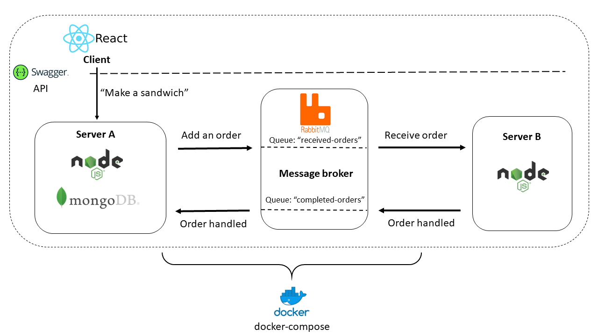

# TIE-23526 Web Architectures - Group project work repository

 
### Required documentation
The documentation required includes the project plan, architectural description of the system, the technologies used, the progress of the group's work, as well as what the group's members learned during this project. Groups also must document where the components of their system are placed in the repository, and how the course personnel can deploy the group's system on their own computers when testing it.

Groups can of course add any extra documentation they feel is useful, and if course personnel finds the documentation useful and well written, this extra documentation will affect the points positively.

### Project plan


#### Course project group information

Vilhelmi Lehtonen, 268600, vilhelmi.lehtonen@tuni.fi \
Tommi Mikkola, 266986, tommi.mikkola@tuni.fi \
Tommi Brusila, 266200, tommi.brusila@tuni.fi \
Group name: Double T & V \
Gitlab repo URL: https://course-gitlab.tuni.fi/webarch-2021/double-t-and-v

#### Working during the project
Due to all group members having very tight schedules, no strict timetable was created for the project. However, by dividing the project into sensible tasks in Gitlab board, each member was able to work independently and effectively. All of the members work in the software industry so this way of working is exremely familiar to the members. The issues were self-assigned. 

By looking into the project description we realized, that implementing the mandatory parts would not pose significant challenges and could be done quite easily. Due to this fact and due to other work, we did not take the project on immediately. Only big thing that was unfamiliar to us was RabbitMQ, into which we put extra exploration and investigation. So, in the beginning we would purposly not invest too many hours into the project, but we would focus our effort in the later weeks.

After dividing the project into sensible chunks, we discussed our roles in the project. Below are the main responsibilities and hours to be committed for the project. Naturally these responsibilities mixed up during the project, as someone was done with a feature and could help out with another one. The biggest workload in our mind was the frontend so Tommi B would focus mainly on that. All members are familiar with React and would help out when needed.

* Tommi M (6h/week): Server A, docker-compose, and database
* Tommi B (6h/week): Frontend
* Vilhelmi (6h/week): server-b, RabbitMQ, documentation

For version control, it was decided that each Gitlab task would be implemented more or less in separate feature branches. The idea was that when the feature would be finished, the ticket would be closed and the feature merged into develop branch. The purpose of this was to keep the dev branch as a functioning test branch and to avoid merge conflicts. This procedure was followed quite loosely as some featured would be required by others and would be merged when needed. There was big dependancy between components.


Below is a rough estimate on how the project was to be carried out schedulewise:

Initial timetable:
- Week 12: Start of the project. Repositories created.
- Week 13: Working on other projects and also dayjobs.
- Week 14: Creating initial files and branches for the components. Setting up environments. Mid-project check-in
- Week 15:
- Week 16:
- Week 17: Implementing voluntary parts if enough time. Decorating the frontend. Cleaning up code. Finishing documentation. 


During the project we had good communication and held weekly meetings where we would catch up with our work. In a project of this size, we really had no difficulty of understanding what each member had been doing. We also had code sessions where each member would be implementing something.


### Documentation of the created system
Following describes what needs to be documented during the project.

Those groups that use other technologies/architecture than described need to apply these instructions to fit their choices.

#### System architecture

**System architecture overview**


This project features a React frontend. React is a popular Javascript framework and was heavily recommended to be used by the course staff. The client is used by the user to create a sandwich order and ask for sandwich statuses. The client uses Axios, an HTPP client, to communicate with server-a. Server-a implemets a predefined Swagger-API. When the user chooses to create a order from the client, the request is routed to the correct controller via SwaggerRouter. In this case, the Order controller. This controller then creates a new database entry into MongoDB and also adds the order to a RabbitMQ queue. The communication between the server and the RabbitMQ message queue is handled using AMQP application layer protocol. These messages sent by server-a are then subscribed by server-b which then "completes" the order and sending the order back to another queue. Server-a then listens to this queue for ready orders and updates the status to "ready". 

Also, the user can view the status for orders from the client.

The entire project is deployed using Docker and specifically docker-compose. Client, server-a, RabbitMQ, MongoDB and server-b  have been defined in docker-compose.yaml as services. 


**Project file structure**
```
double T and V
│   README.md
│   docker-compose.yml  # Used by docker-compose to run the multi-container project
│
└───backend
│   └───rabbitmq  # Empty folder. RabbitMQ is run from a ready-made image
|   |   |   README.md
|   |
│   └───server-a   # Implements the API
|   |   └───api                    
|   |   |   |   swagger.yaml   # Defines the API
|   |   |   
│   |   └───controllers      # Handles the requests directed by the Swagger router.
|   |   |   |   Order.js     # Handles creation of sandwiches and querying of sandwich statuses.
|   |   |   |   Sandwich.js  # NOT IMPLEMENTED
|   |   |   |   User.js      # NOT IMPLEMENTED
|   |   |   
|   |   └───models
|   |   |   |   order.js  # Database model for a sandwich order
|   |   |   
|   |   └───rabbit-utils
|   |   |   |   receiveTask.js  # Subscribe to ready orders
|   |   |   |   sendTask.js     # Queue received orders
|   |   |   
│   |   └───service     # Control responses to client 
|   |   |   |   OrderService.js
|   |   |   |   SandwichService.js
|   |   |   |   UserService.js
|   |   |   
|   |   └───utils
|   |   |   |   wait-for-it.sh # Ping and wait a port and execute something after.
|   |   |   |   writer.js # Help with responses
|   |   |   
|   |   |    Dockerfile # Defines server-a docker container and commands.
│   |   |    README.md
|   |   |    db.js      # Database connection
|   |   |    index.js   # Creates server-a. Connects to DB and listens to queue.
│   |   |    package-lock.json
|   |   |    package.json
|   |   
│   └───server-b
|   |   └───rabbit-utils
|   |   |   |   receiveTask.js  # Subscribe to orders sent from server-a
|   |   |   |   sendTask.js   # Send ready orders to queue.
|   |   |   
|   |   └───utils
|   |   |   |   wait-for-it.sh
|   |   |   
│   |   │   Dockerfile # Defines server-a docker container and commands.
│   |   │   README.md
│   |   │   index.js  # Server-b. Only listens to queue and adds ready orders
│   |   │   package.json
│   
└───course-documentation
|   │   README.md
│     
└───frontend
|   └───public  # Static files
|   └───src     # Application code
|   |   └───App 
|   |   |   |   Services.js  # Requests to server-a
|   |   |   |   index.js     # Main App component
|   |   |   |   style.css    # App styles
|   |   |
|   |   |   index.js  # Client start point
|   |   |  
|   │   Dockerfile # Defines client docker container and commands.
|   |   README.md
|   │   package-lock.json
|   |   package.json
```

````
ORIGINAL
The focus should on applying what has been learned on the course about Web Architectures. Using proper architectural descriptions and UML diagrams would be appropriated, but the groups are welcome to use any reasonable way of describing the system.

Matters to describe include architectural patterns, components, component's roles, communication within the system and with external components, and others group finds important when describing the architecture. Describe the system with enough detail, so that a technical person with no prior knowledge of the system would be able to understand it. Use images and diagrams whenever you are able.

It is important to evaluate the architecture and compare it other possible architectures. Elaborate on the strengths and weaknesses of this architecture when compared to its purpose and tasks as described in the assignment document. Consider other architectures that would have been able to fulfill the system's described purpose and tasks. This part is where your group gets to explore architectures that could have been used to produce a system with the same or at least similar functionality. The sky is the limit here, get creative!`

````

#### Used technologies
- Node.js: An asynchronous Javascript runtime. Used for server-a and server-b. 
- React: A Javascript framework for building interactive Single-Page Applications. React only re-renders the components that are uppdated without loading the entire page.
- RabbitMQ: An open-source message broker that is AMQP compliant among others. Enables asynchronous messaging and message queueing.
- AMQP: Advanced Message Queuing Protocol. Application layer protocol for communicating with the RabbitMQ. The protocol is client agnostic meaning that any client can be used with the protocol.
- Swagger: API development and documentation tool. It uses OpenAPI specification, which creates a RESTful interface for developing and consuming an API.
- MongoDB: Is a NoSQL database that uses JSON-like documents.
- Docker (docker-compose): A tool for defining and running multi-container Docker applications.

For the frontend, we decided to go with the recommended option. We all have previous with React and could have also gone with some other option such as Angular.js or Vue.js. However, we decided not to do so due to course recommendation and for our convinience.

For the backend framework, node.js was effectively the only option, as a lot of JavaScript code was already implemented. Other options could have been Deno, which is quite a new arrival. Deno is supposed to be simpler and a more light approach and supports JavaScript and Typescript. It also claims to be secure by default. This would have had a moderate learning curve coming from Node but choosing Node was quite a no-brainer for us.

Storing the order status data was something where we gave thought to many different options. The requirement was that the statuses would not have to be preserved between server resets. We gave a thought to node-persist, which is a localStorage on the server side. However, we still decided to go for an actual database for the purpose that if we were to implement the User and Sandwich models we would definitely need a database. We debated between PostgreSQL and MongoDB and decided to go with the latter due to the JSON-like documents and begin a bit "lighter" in our opinion. 

Changing RabbitMQ, AMQP, Swagger and Docker to alternative technologies were not an option. The entire project could be hosted in the cloud of course, but this was not necessary in this project. If one would like to deploy the project for everyone to see, then taking the project to cloud would be the way to go. 


````
ORIGINAL
Description of the technologies used in the system (Node, RabbitMQ, AMPQ, ...), how the technologies were used in the project, and the group's view of the technologies from your use. Could other/better alternatives have been used? Or is there an alternative that would have been more interesting to the group?
````

#### How the produced system can be tested
Here group describes how course personnel can test their system. A complete HOWTO on running your system, with easily copy-pastable examples.

### Learnign during the project
A group learning diary, here group's members note down the learning during the project. Short descriptions of who, what, and when is sufficient. What could be a link to GitLab Issue, that has more information.

This information is interesting to the course personnel, too. We get to see if the project enabled learning as designed.

Tommi M:

Tommi B:

Vilhelmi:


